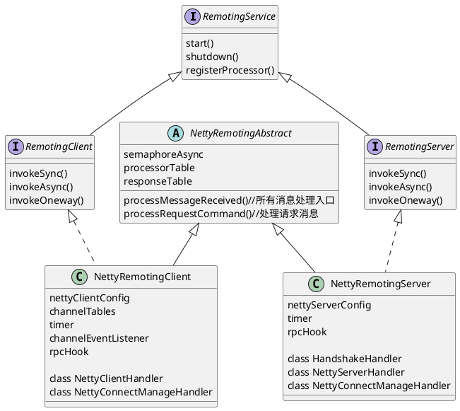
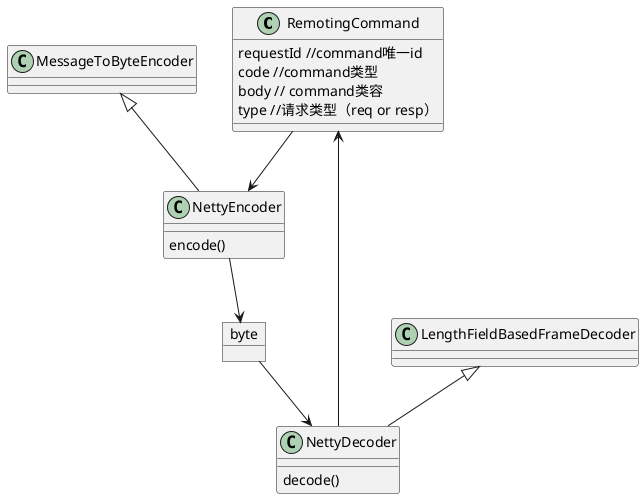
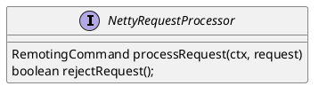
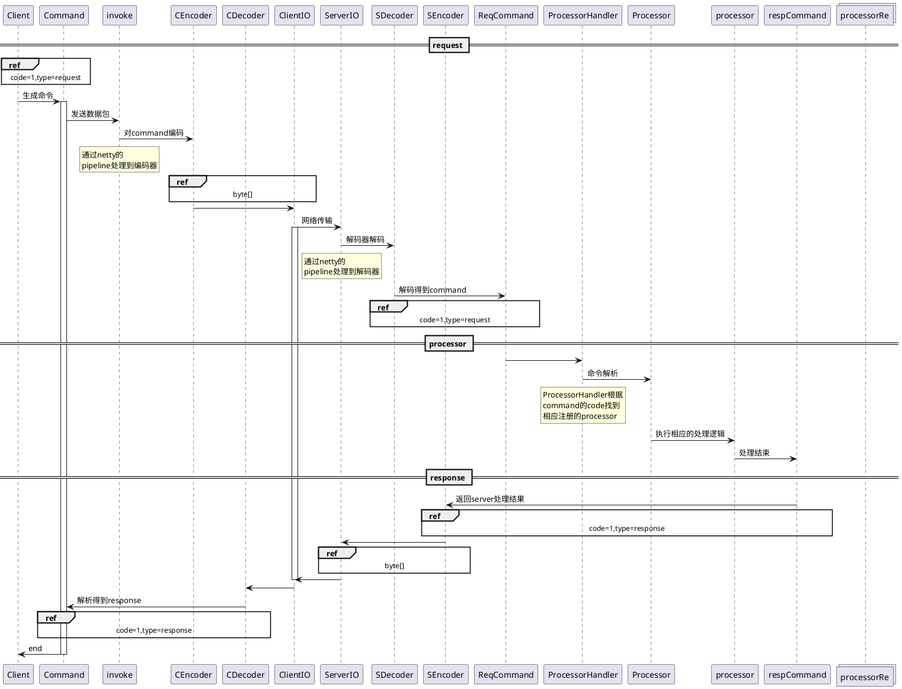

### service管理模块

```plantuml
@startuml
interface RemotingService {
    start()
    shutdown()
    registerProcessor()
}
interface RemotingClient extends RemotingService{
    invokeSync()
    invokeAsync()
    invokeOneway()
}
interface RemotingServer extends RemotingService{
    invokeSync()
    invokeAsync()
    invokeOneway()
}
abstract NettyRemotingAbstract{
    semaphoreAsync
    processorTable
    responseTable
    processMessageReceived()//所有消息处理入口
    processRequestCommand()//处理请求消息
}

class NettyRemotingClient extends NettyRemotingAbstract implements RemotingClient{
    nettyClientConfig
    channelTables
    timer
    channelEventListener
    rpcHook
    
    class NettyClientHandler
    class NettyConnectManageHandler

}
class NettyRemotingServer extends NettyRemotingAbstract implements RemotingServer{
    nettyServerConfig
    timer
    rpcHook

    class HandshakeHandler
    class NettyServerHandler
    class NettyConnectManageHandler
}
@enduml
```

### 解码传输模块

```plantuml
@startuml
class RemotingCommand{
    requestId //command唯一id
    code //command类型
    body // command类容
    type //请求类型（req or resp）
}

Object byte
class NettyEncoder extends MessageToByteEncoder{
    encode()
}
class NettyDecoder extends LengthFieldBasedFrameDecoder{
    decode()
}
RemotingCommand --> NettyEncoder
NettyEncoder --> byte
byte --> NettyDecoder
NettyDecoder --> RemotingCommand
@end
```

### 处理模块

```plantuml
@startuml

interface NettyRequestProcessor {
    RemotingCommand processRequest(ctx, request)
    boolean rejectRequest();
}
@end
```
### 时序图

```plantuml
@startuml
== request ==
ref over Client, Command : code=1,type=request
Client -> Command : 生成命令
activate Command
Command -> invoke : 发送数据包
invoke -> CEncoder : 对command编码
participant CDecoder
rnote over invoke
 通过netty的
 pipeline处理到编码器
 endrnote
ref over CEncoder, ClientIO : byte[]
CEncoder -> ClientIO : 
ClientIO -> ServerIO :网络传输
activate ClientIO
ServerIO -> SDecoder : 解码器解码
rnote over ServerIO
 通过netty的
 pipeline处理到解码器
 endrnote
participant SEncoder
SDecoder -> ReqCommand : 解码得到command
ref over SDecoder, ReqCommand : code=1,type=request
== processor ==
ReqCommand -> ProcessorHandler :
ProcessorHandler -> Processor : 命令解析
rnote over ProcessorHandler
 ProcessorHandler根据
 command的code找到
 相应注册的processor
 endrnote
 Processor -> processor : 执行相应的处理逻辑
 processor -> respCommand : 处理结束
 collections processorRe
== response ==
respCommand -> SEncoder : 返回server处理结果
ref over SEncoder, respCommand : code=1,type=response
SEncoder -> ServerIO :
ref over SEncoder, ServerIO : byte[]
ServerIO -> ClientIO :
deactivate ClientIO
ClientIO -> CDecoder : 
CDecoder -> Command : 解析得到response
ref over CDecoder, Command : code=1,type=response
Command -> Client : end
deactivate Command
@enduml
```