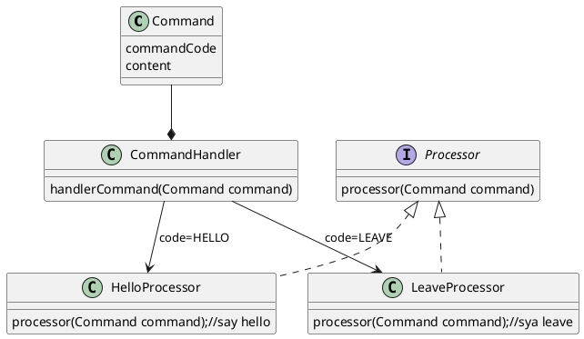
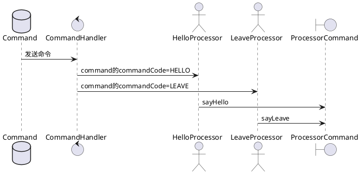

### UML图

```plantuml
@startuml
class Command{
    commandCode
    content
}
class CommandHandler{
    handlerCommand(Command command)
}
interface Processor{
    processor(Command command)
}
class HelloProcessor implements Processor{
    processor(Command command);//say hello
}
class LeaveProcessor implements Processor{
    processor(Command command);//sya leave
}

Command --* CommandHandler
CommandHandler --> HelloProcessor : code=HELLO
CommandHandler --> LeaveProcessor : code=LEAVE
@enduml
```
### 时序图

```plantuml
@startuml
database Command
control CommandHandler
actor HelloProcessor
actor LeaveProcessor
boundary ProcessorCommand
Command -> CommandHandler : 发送命令
CommandHandler -> HelloProcessor : command的commandCode=HELLO
CommandHandler -> LeaveProcessor : command的commandCode=LEAVE
HelloProcessor -> ProcessorCommand : sayHello
LeaveProcessor -> ProcessorCommand : sayLeave
@enduml
```