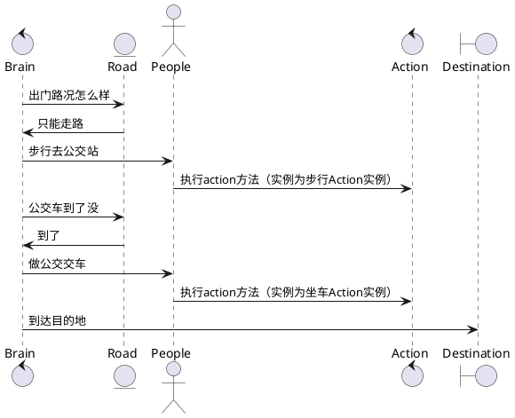

Brain 持有步行的Action实例，坐车的Action实例。Action共有action方法

```plantuml
@startuml

control Brain
entity Road
actor People
control Action
boundary Destination
Brain -> Road : 出门路况怎么样
Road -> Brain : 只能走路
Brain -> People : 步行去公交站
People -> Action : 执行action方法（实例为步行Action实例）
Brain -> Road : 公交车到了没
Road -> Brain : 到了
Brain -> People : 做公交交车
People -> Action : 执行action方法（实例为坐车Action实例）
Brain -> Destination : 到达目的地
@enduml
```